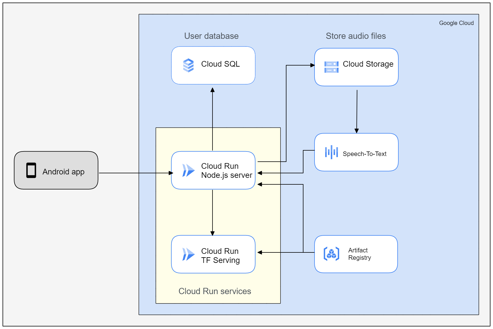

# Deploying to GCP

Here are the steps to manually deploy our back-end to Google Cloud Platform. Every command is run in Cloud Shell unless specified otherwise.

GCP services used:

- Cloud Run
- Cloud SQL
- Artifact Registry
- Cloud Storage
- Speech-to-Text API

## GCP architecture



## Set environment variables and enable services

```bash
export PROJECT_ID=$(gcloud config get-value project)
export PROJECT_NUMBER=$(gcloud projects describe $PROJECT_ID --format='value(projectNumber)')
export REGION=asia-southeast1

gcloud services enable \
    sqladmin.googleapis.com \
    run.googleapis.com \
    vpcaccess.googleapis.com \
    servicenetworking.googleapis.com \
    speech.googleapis.com \
    artifactregistry.googleapis.com
```

## GCS setup

1. Make bucket.

    ```bash
    gsutil mb -l asia -b on gs://anticede
    ```

2. Create folder with name: `audio`.
3. Upload the .sql file provided in this folder for later use.

## Cloud SQL setup

1. Allocate IP address range.

    ```bash
    gcloud compute addresses create anticede-ip \
        --global \
        --purpose=VPC_PEERING \
        --prefix-length=20 \
        --network=projects/$PROJECT_ID/global/networks/default
    ```

2. Create private connection.

    ```bash
    gcloud services vpc-peerings connect \
        --service=servicenetworking.googleapis.com \
        --ranges=anticede-ip \
        --network=default \
        --project=$PROJECT_ID
    ```

3. Create MySQL instance.

   ```bash
   gcloud sql instances create anticede-sql \
        --project=$PROJECT_ID \
        --network=projects/$PROJECT_ID/global/networks/default \
        --no-assign-ip \
        --database-version=MYSQL_8_0 \
        --cpu=2 \
        --memory=4GB \
        --region=$REGION \
        --root-password=anticederoot123
    ```

4. Create database.

    ```bash
    gcloud sql databases create anticede-db --instance=anticede-sql
    ```

5. Create user.

    ```bash
    gcloud sql users create anticede \
        --password=anticede123 \
        --instance=anticede-sql
    ```

6. Import MySQL database.

    1. Click `anticede-sql` instance.
    2. Click import from the top menu.
    3. Browse and select the .sql file uploaded before.
    4. For destination, choose anticede-db.
    5. Click import.

7. Show SQL instance IP, copy and save for later use.

    ```bash
    gcloud sql instances describe anticede-sql \
        --format=json | jq \
        --raw-output ".ipAddresses[].ipAddress"
    ```

8. Add Cloud SQL Client role to Compute Engine service account.

    ```bash
    gcloud projects add-iam-policy-binding $PROJECT_ID \
        --member="serviceAccount:$PROJECT_NUMBER-compute@developer.gserviceaccount.com" \
        --role="roles/cloudsql.client"
    ```

9. Create Serverless VPC Access connector.

    ```bash
    gcloud compute networks vpc-access connectors create anticede-connector \
        --region=${REGION} \
        --range=10.8.0.0/28 \
        --min-instances=2 \
        --max-instances=3 \
        --machine-type=f1-micro
    ```

## Artifact Registry

Create Artifact Registry repository.

```bash
gcloud artifacts repositories create anticede \
    --location=$REGION \
    --repository-format=docker 
```

## Cloud Run setup

This part is mostly manual because we didn't configure a CI/CD pipeline.

### TensorFlow Serving

- In local

    1. Clone project repo from GitHub.

        ```bash
        git clone https://github.com/RashidMaulana/Anticede.git

        cd Anticede/'Machine Learning'/tf-serving 
        export PROJECT_ID=#your GCP project ID
        ```

    2. Build and push Docker image.

        ```bash
        docker build -t tsanva/anticede-model:v1 .

        docker tag tsanva/anticede-model:v1 asia-southeast1-docker.pkg.dev/$PROJECT_ID/anticede/anticede-model:v1
        docker push asia-southeast1-docker.pkg.dev/$PROJECT_ID/anticede/anticede-model:v1
        ```

- In GCP

    1. Deploy to Cloud Run.

        ```bash
        gcloud run deploy anticede-model \
            --image=asia-southeast1-docker.pkg.dev/$PROJECT_ID/anticede/anticede-model:v1 \
            --region=$REGION \
            --cpu=1 \
            --memory=512Mi \
            --min-instances=0 \
            --max-instances=4 \
            --port=8501
        ```

    2. Show Cloud Run service URL, copy and save for later use.

        ```bash
        gcloud run services describe anticede-model --platform managed --region $REGION --format 'value(status.url)'
        ```

### Node.js web server

- In local

    1. Clone project repo from GitHub.

        ```bash
        git clone https://github.com/RashidMaulana/Anticede.git

        cd Anticede/'Cloud Computing' 
        export PROJECT_ID=#your GCP project ID
        ```

    2. Create `.env` file.
       For use with dotenv library. `.env` file should contain these following environment variables:

        ```bash
        DB_HOST=#SQL instance IP address, check above.
        DB_USER=anticede
        DB_PASSWORD=anticede123
        DB_DATABASE=anticede-db
        DB_PORT=3306
        SECRET_STRING = 'secret string'
        SECRET_STRING_ADMIN = 'secret string admin'
        TFSERVING_URL=#anticede-model cloud run service url, check above.
        ```

    3. Build and push Docker image.

        ```bash
        docker build -t tsanva/anticede:v1 .

        docker tag tsanva/anticede:v1 asia-southeast1-docker.pkg.dev/$PROJECT_ID/anticede/anticede:v1
        docker push asia-southeast1-docker.pkg.dev/$PROJECT_ID/anticede/anticede:v1
        ```

- In GCP

    1. Deploy to Cloud Run.

        ```bash
        gcloud beta run deploy anticede\
        --image=asia-southeast1-docker.pkg.dev/$PROJECT_ID/anticede/anticede:v1 \
        --region=$REGION \
        --cpu=1 \
        --memory=512Mi \
        --min-instances=0 \
        --max-instances=4 \
        --port=8080 \
        --execution-environment=gen2 \
        --vpc-connector=anticede-connector
        ```

    2. Show Cloud Run service URL.

        ```bash
        gcloud run services describe anticede --platform managed --region $REGION --format 'value(status.url)'
        ```
